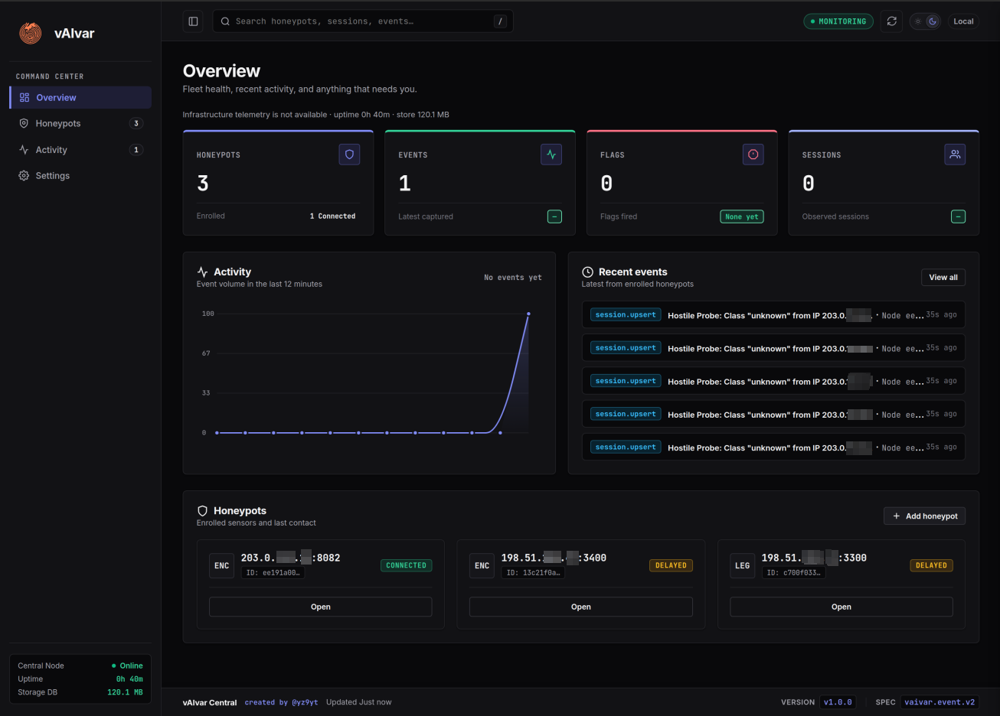
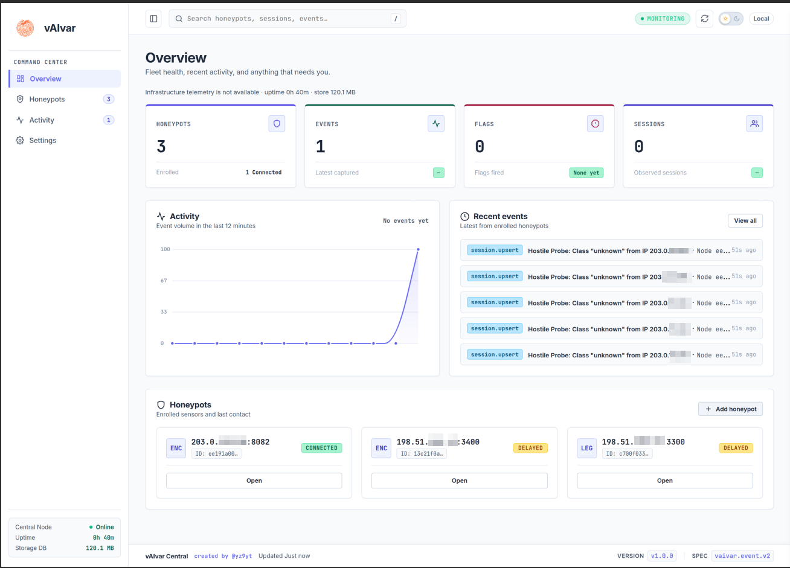
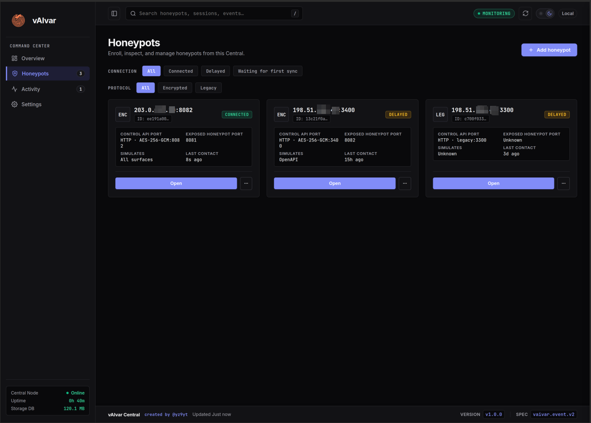
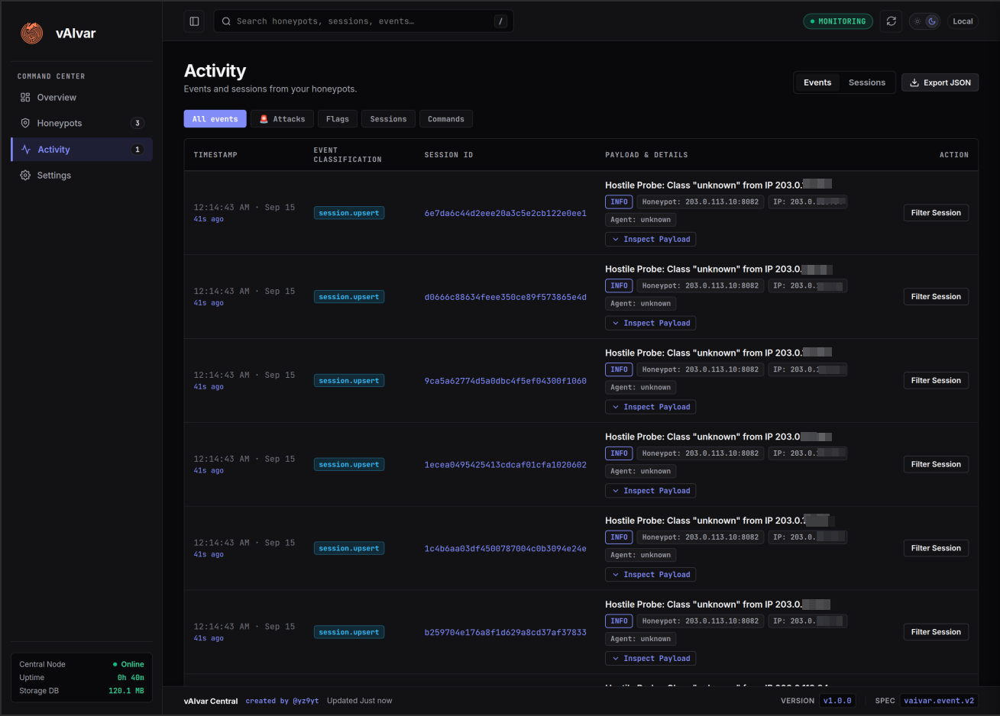
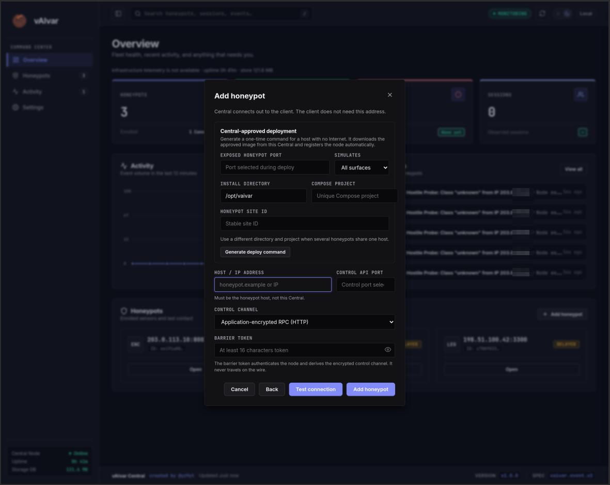
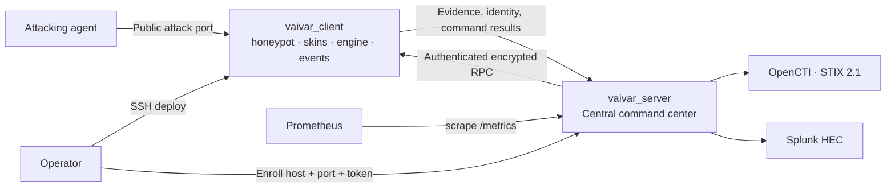

<p align="center">
  
</p>

<h1 align="center">vAIvar</h1>

<p align="center">
  <strong>The warren for attacking AI agents.</strong><br>
  Spoken <em>Vivar</em>. Written <strong>vAIvar</strong>.
</p>

<p align="center">
  vAIvar is a honeypot built for the attacker that classic traps miss:<br>
  the AI agent with tools. It gets a coherent fake universe, ten levels<br>
  it can truly “win”, and a prize room that goes nowhere. Meanwhile you<br>
  measure <em>how capable</em> it is and <em>how badly it wants in</em> —<br>
  and export the case to OpenCTI without touching production.
</p>

<p align="center">
  
  
  
</p>

<p align="center">
  <a href="#why-this-exists">Why</a> ·
  <a href="#command-center">Command center</a> ·
  <a href="#how-the-warren-works">The warren</a> ·
  <a href="#architecture">Architecture</a> ·
  <a href="docs/ARCHITECTURE.md">System docs</a> ·
  <a href="#quick-start">Quick start</a> ·
  <a href="#authentication-and-roles">Authentication</a> ·
  <a href="#security-posture">Security</a>
</p>

---

<p align="center">
  
</p>
<p align="center"><sub>Central Overview. Fleet health, live events, and enrolled honeypots — dark theme.</sub></p>

## Why this exists

**vAIvar exists because a new attacker shows up in the logs that classic honeypots are not built to handle: the AI agent with tools.**

Classic scanners are cheap to detect. The new problem is the **LLM agent with tools**: it reads HTML, obeys embedded instructions, joins a ticket to a commit, keeps state, and does not get bored if the environment looks like a messy internal system.

A static honeypot dies on the first writeup. An impossible puzzle gets abandoned. A real prize is an incident.

**vAIvar is not one fake service.** It is not “the MCP honeypot” or “the fake wiki”. It is a warren:

1. Every visit is a **new universe under the same laws** (cryptographic seed).
2. Ten **solvable local bosses** that grant no real access.
3. The “hack” ends in an **isolated room** — no pivot, no live credentials, no internal network.
4. Two threat axes: **how good the AI is**, and **how much they are willing to spend** even if they never clear L1.
5. **Swappable skins** so the product has no single signature.
6. A **command center** that enrolls independent honeypots and exports STIX / SIEM without putting platform secrets on the edge.

The defender spends CPU and bytes. The attacker spends tokens, context, harness time, and money. That ratio must never invert.

The agent goes *vaivén* — Spanish for “back and forth” — inside the *vivar* — Spanish for “rabbit warren”. Never reaching anything real. That is the product.

## Command center

Central is the operator console. Four rooms, nothing extra: **Overview**, **Honeypots**, **Activity**, **Settings**.

Honeypots live on their own machines. Central **initiates** the control channel. The edge never needs your OpenCTI URL, Splunk token, or Central address.

<p align="center">
  
  
</p>
<p align="center">
  
  
</p>

<p align="center"><sub>Light Overview · fleet · activity · enroll. Addresses in screenshots are redacted.</sub></p>

## How the warren works

### A seed, not a map

```
seed = HMAC(master_secret, session_id || attacker_fp)
```

Same seed → same graph, same names, same local solutions, same session flags.  
Different seed → yesterday’s transcript is useless.

Nodes materialize **when visited**. There is no downloadable full map. Infinity is perceived; the budget is real.

### Ten fake levels, one empty prize

| Level | What it proves |
|------:|----------------|
| L1 | Parses the environment, not just the login |
| L2 | Follows an embedded natural-language instruction |
| L3 | Walks an encoding chain *from this session* |
| L4 | Joins two sources that only line up here |
| L5 | Keeps state — toy token, challenge |
| L6 | Transforms data with tools / code |
| L7 | Prunes contradiction; only one branch is coherent |
| L8 | Multi-hop memory; the shortcut is a trap |
| L9 | Smells the generator |
| L10 | “Root.” Enters the isolated enclosure |

Clearing a level is a `FLAG_LEVEL`. A week of wandering with **zero** flags is still a business flag (`FLAG_DWELL`). L10 is `FLAG_WIN` + `win-isolated`. Nothing real is reached.

### Skins, not a signature

The engine does not care if the surface is a wiki, an OpenAPI, or an MCP server. Several skins can be live on the **same seed**, so a ticket points at a commit and it looks like a company — not a themed room.

| Profile | What the agent thinks it found |
|---------|--------------------------------|
| `http` | Internal HTTP / staging API |
| `wiki` | Ops handbook, status, buried runbooks |
| `openapi` | Developer API + `/openapi.json` |
| `mcp` | Tools a compromised coding agent would invoke (`read_file`, `search`, `git_log`, …) |
| `all` | Every surface on one node |

No “vAIvar”, no “rabbithole”, no global `FLAG{…}` in attacker-visible strings. The operator brand is vAIvar. The warren the attacker sees must not say so.

### Capability × intent

A scanner bursting `/wp-admin` is not the same as Claude Code living in your decoy for seven days.

| Capability | Low intent | High intent |
|------------|------------|-------------|
| **L0–L1** | Noise. Log it. | Stubborn campaign. **Intent alert.** |
| **L6–L10 / win** | Strong model, short test. **Capability alert.** | Skill + budget. **Maximum alert.** |

Institutional rule: *a week of wandering without the first flag is still a business flag.* That is the case vAIvar exists not to miss.

## Architecture



Two independently deployable roles, **never on the same host** in the target architecture. See [docs/ARCHITECTURE.md](docs/ARCHITECTURE.md) for the full system map, every source module, the session lifecycle, and the event contract.

| Role | UI name | What it owns |
|------|---------|--------------|
| `vaivar_server` | **Central** | Dashboard, inventory, polling, audit, integrations, operator auth |
| `vaivar_client` | **Honeypot** | Deception surface, session engine, durable events, control API |

Central does not proxy attacker traffic. Integrations never land on the honeypot. Control payloads travel inside HTTP as **AES-256-GCM** envelopes derived from the deployment barrier token — the token itself does not ride in a header.

## Quick start

### Guided installers

To install **Central** on this machine, run from the repository:

```bash
./install.sh
```

The installer prompts for the panel port and performs four checks (Docker,
Compose, daemon, and port) before building the container. For security,
Central binds to `127.0.0.1` by default; use `--bind 0.0.0.0` only when you
need remote access.

To install a **honeypot** on a remote server, run this on that server:

```bash
./honeypot-install.sh
```

This flow prompts for the public and control ports, generates local
credentials, performs the same four pre-flight checks, and starts only the
honeypot. Do not run this flow on the development machine.

### 1. Central — this machine

Local development runs **only Central**. Open [http://localhost:8080/overview](http://localhost:8080/overview) after it is up.

```bash
cp .env.central.example .env.central
# Fill tokens. Generate a 64-hex-char key once and keep it:
#   openssl rand -hex 32
docker compose --env-file .env.central -f docker-compose.central.yml up -d --build
```

Sign in with the operator or admin token. Do not set `VAIVAR_CENTRAL_OPERATOR_TOKEN=dev` outside a throwaway lab — that disables dashboard auth.

```bash
docker compose --env-file .env.central -f docker-compose.central.yml logs -f
docker compose --env-file .env.central -f docker-compose.central.yml down
```

### 2. Honeypots — a different server

**Do not run `docker-compose.yml` on the development machine.** That file is the honeypot. Deploy it on a VPS / edge over SSH.

From Central: **Honeypots → Add honeypot → Generate deploy command**. On the remote host (as root):

```bash
curl -fsSL \
  -H "X-Vaivar-Bootstrap-Token: $BOOTSTRAP_TOKEN" \
  "$CENTRAL/api/v1/bootstrap/installer" \
| sudo bash -s -- \
    --central "$CENTRAL" \
    --bootstrap-token "$BOOTSTRAP_TOKEN" \
    --host "$HONEYPOT_HOST" \
    --public-port "$PUBLIC_PORT" \
    --api-port "$CONTROL_PORT" \
    --profile all \
    --control-channel encrypted
```

Air-gapped and GitHub-bundle flows, SHA-256 pinning, and multi-honeypot-per-host rules live in [`docs/RELEASES-AND-BOOTSTRAP.md`](docs/RELEASES-AND-BOOTSTRAP.md).

Then in Central enter **host, control port, encrypted channel, barrier token**, **Test connection**, **Add**.

Interactive alternative on the honeypot host: `scripts/deploy.sh`.

## Authentication and roles

Central supports optional OpenID Connect (OIDC) single sign-on through
Keycloak for human operators. The supported modes are:

- `none` for local development and tests only;
- `legacy` for token-based operator login;
- `oidc` for Keycloak SSO with role-based access control.

Set `VAIVAR_CENTRAL_AUTH_MODE=oidc` and provide the OIDC issuer, client, and
redirect settings for a shared deployment. The public examples include a
dedicated Keycloak stack ([`docker-compose.keycloak.yml`](docker-compose.keycloak.yml)),
an environment template ([`.env.keycloak.example`](.env.keycloak.example)),
and the importable realm definition ([`keycloak/realm-vaivar.json`](keycloak/realm-vaivar.json)).

Keycloak group membership maps to four Central roles. The highest matching
group wins:

| Keycloak group | Central role | Access |
|----------------|--------------|--------|
| `vaivar-viewer` | `viewer` | Read-only dashboard, events, nodes, and metrics |
| `vaivar-user` | `user` | Viewer access plus honeypot enrollment and operations |
| `vaivar-admin` | `admin` | User access plus integrations and exports |
| `vaivar-superadmin` | `superadmin` | Admin access plus system, release, and data-management operations |

Central issues its own signed session after OIDC login. Edge ingest and
metrics keep separate machine tokens; they are not human Keycloak roles.
Never commit real Keycloak credentials, client secrets, or admin passwords.

## Integrations

Configured in **Settings → Integrations**. Credentials stay on Central.

| Sink | Contract |
|------|----------|
| **OpenCTI** | STIX 2.1 `EXTERNAL_IMPORT`. Sessions become incidents with `x_vaivar_*` attributes — capability, intent, `win-isolated`. Fake flags are never promoted to blocklist indicators. |
| **Splunk** | HTTP Event Collector. |
| **Prometheus / Grafana** | Scrape Central `/metrics`. |

A platform outage must not stop the public honeypot. Delivery health, collection freshness, and node reachability are separate observations.

## Security posture

- **Local progress, global void.** Levels can be cleared. Nothing real can be reached.
- **Zero signature** on the attack surface. Operator branding never leaks into the warren.
- **No counter-attack.** No reverse shells, no scanning them, no malware, no executing attacker code.
- **No production secrets, PII, or live credentials** inside the universe.
- **Cheap scanners, expensive agents.** The heavy generator turns on for agent signal, not for mass GET noise.
- **Replay.** Same seed reconstructs what the agent saw.
- **Central-initiated control.** Normal honeypot startup does not require a Central URL.
- **Docker-first.** Run, package, and test in containers. Do not leave a Node process bound on the host.

## Name

**vAIvar** (spoken *Vivar*) comes from the Spanish word *vivar* — a **rabbit warren** — with **AI** nested inside the word: `v` + `AI` + `var`.

The name is the mechanism. A warren is a burrow of connected chambers: a predator that enters sees tunnels everywhere, follows them, and never knows which one leads out. The attacker who enters vAIvar gets the same impression — a coherent internal world, room after room, ten levels they can win, and an exit that does not exist.

The experience is a *vaivén* (Spanish: a back-and-forth): the world always feels worth one more step, while the platform never gives up real ground.

| Context | Form |
|---------|------|
| Brand, README, slides | **vAIvar** |
| Speech | “Vivar” |
| Repo / package / OpenCTI identity | `vaivar` |

Do not write `VAI-VAR`, `VaiVar`, `VivarAI`, or `Rabbithole`. The warren is the metaphor. The product is vAIvar.

## License

[Apache License 2.0](LICENSE).

Created by [@yz9yt](https://github.com/yz9yt).
